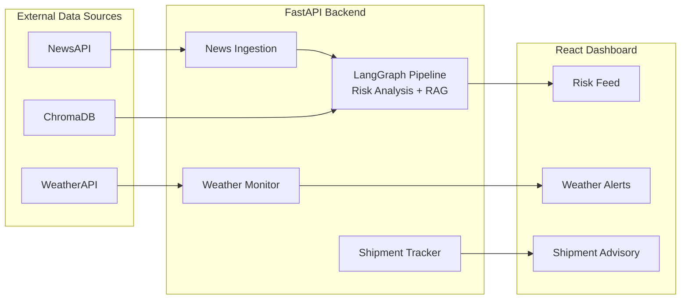

# 🚢 RiskRadar – Agentic Supply Chain Risk Intelligence Platform

> **Real-time supply chain disruption detection powered by LangGraph, RAG, and live intelligence.**

RiskRadar is an AI-powered platform that helps supply chain teams proactively identify disruptions before they significantly impact logistics operations. By combining **live news intelligence**, **weather monitoring**, **Retrieval-Augmented Generation (RAG)**, and **agentic AI workflows**, RiskRadar provides actionable risk alerts, shipment delay estimates, and historical context for better decision-making.

---

## 📖 Overview

Global supply chains are constantly affected by events such as geopolitical conflicts, extreme weather, port congestion, strikes, and natural disasters. Most monitoring systems react only after disruptions become widely known.

RiskRadar continuously monitors live data sources and enriches them with historical knowledge to provide contextual, explainable, and actionable insights.

### Example Use Case

During the **2021 Ever Given blockage of the Suez Canal**, global trade was severely disrupted for nearly a week.

RiskRadar is designed to identify emerging disruptions from early news reports and weather signals, allowing supply chain managers to assess potential risks sooner and make informed routing decisions.

---

## ✨ Features

### 📰 Live News Intelligence

- Fetches real-time global news using **NewsAPI**
- Processes every article through a **2-node LangGraph pipeline**
- Detects:
  - Supply chain relevance
  - Affected shipping routes
  - Impacted industries
  - Risk severity
- Generates structured AI-powered alerts with:
  - Risk summary
  - Historical context
  - Recommended actions

---

### 🌦 Weather Risk Monitoring

Continuously monitors weather conditions across **30 major ports and maritime chokepoints**, including:

- Suez Canal
- Panama Canal
- Strait of Malacca
- Red Sea
- Taiwan Strait
- Singapore
- Rotterdam
- Shanghai
- Los Angeles
- Hamburg
- Dubai
- and more...

Detects:

- Storms
- Heavy rain
- Fog
- High winds
- Poor visibility

Provides **3-day weather forecasts** to identify risks before they impact shipping operations.

---

### 🚚 Shipment Risk Advisory

Users enter:

- Origin
- Destination
- Expected delivery date

RiskRadar automatically:

- Detects the shipping route
- Checks live weather conditions
- Checks ongoing news events
- Retrieves similar historical disruptions using RAG
- Estimates shipment delays
- Suggests alternate routes when appropriate

---

### 🧠 Retrieval-Augmented Generation (RAG)

RiskRadar uses **ChromaDB** as a vector database to retrieve historical supply chain disruptions before generating responses.

Current knowledge base includes:

- Ever Given – Suez Canal Blockage (2021)
- COVID-19 Port Shutdowns
- Semiconductor Shortage
- Russia–Ukraine War
- Red Sea Attacks
- Panama Canal Drought
- Taiwan Strait Tensions
- US–China Trade War
- China Port Congestion
- Port of Rotterdam Strike
- LA & Long Beach Port Strike
- Japan Earthquake & Tsunami
- Strait of Malacca Piracy

This enables the AI to generate responses grounded in historical events rather than relying solely on the language model.

---

## 🤖 Agent Workflow

```text
News Article
      │
      ▼
Node 1
Risk Analysis
(Route • Industry • Severity)
      │
      ▼
Node 2
Retrieve Historical Context (RAG)
      │
      ▼
Generate Risk Alert
```
---

## ⚙ Tech Stack

| Layer | Technology |
|---------|------------|
| Frontend | React.js, Tailwind CSS |
| Backend | FastAPI |
| Agent Framework | LangGraph, LangChain |
| LLM | Google Gemini 2.5 Flash Lite |
| Embeddings | Gemini text-embedding-004 |
| Vector Database | ChromaDB |
| News Source | NewsAPI |
| Weather Source | WeatherAPI |
| Programming Language | Python |

---

## 🏗 System Architecture


---

## 📂 Project Structure

```text
supply-chain-risk-detector/

├── backend/
│   ├── main.py
│   ├── news_ingestion.py
│   ├── risk_analyzer.py
│   ├── knowledge_base.py
│   ├── weather_monitor.py
│   └── shipment_tracker.py
│
├── frontend/
│   └── src/
│       ├── App.js
│       └── components/
│           ├── Navbar.js
│           ├── StatsRow.js
│           ├── RiskFeed.js
│           ├── WeatherAlerts.js
│           └── ShipmentTracker.js
│
└── data/
    └── historical/
```

---

## 🚀 Getting Started

### Prerequisites

- Python 3.10+
- Node.js 18+
- Gemini API Key
- NewsAPI Key
- WeatherAPI Key

---

### Backend Setup

```bash
cd backend

python -m venv venv
```

### Windows

```bash
venv\Scripts\activate
```

### macOS/Linux

```bash
source venv/bin/activate
```

Install dependencies

```bash
pip install langchain \
langchain-google-genai \
langchain-chroma \
chromadb \
fastapi \
uvicorn \
python-dotenv \
newsapi-python \
pdfplumber \
requests \
langgraph
```

Create a `.env` file

```env
GEMINI_API_KEY=YOUR_API_KEY

NEWS_API_KEY=YOUR_API_KEY

WEATHER_API_KEY=YOUR_API_KEY
```

Initialize the vector database

```bash
python knowledge_base.py
```

Run the backend

```bash
uvicorn main:app --reload
```

Backend runs on:

```
http://127.0.0.1:8000
```

---

### Frontend Setup

```bash
cd frontend

npm install

npm start
```

Frontend runs on:

```
http://localhost:3000
```

---

## 📡 API Endpoints

| Method | Endpoint | Description |
|----------|----------|-------------|
| GET | `/` | API Status |
| GET | `/health` | Health Check |
| GET | `/risks` | Analyze Live News Risks |
| GET | `/weather` | Weather Monitoring |
| POST | `/shipment` | Shipment Risk Advisory |
| GET | `/routes` | Available Shipping Routes |
| GET | `/locations` | Monitored Ports |

---

## 🔄 Workflow

```text
Live News + Weather
          │
          ▼
News Filtering
          │
          ▼
LangGraph Risk Analysis
          │
          ▼
Retrieve Historical Context (RAG)
          │
          ▼
Generate AI Risk Alert
          │
          ▼
Shipment Delay Estimation
          │
          ▼
Risk Dashboard
```

## 💡 Key Technical Decisions

**Why 2 nodes instead of 5?** <br>
Originally built with 5 separate LangGraph nodes — each making an individual Gemini API call. Consolidated into 2 nodes reducing API usage by 60% while maintaining the same output quality.

**Why ChromaDB over Pinecone?** <br>
ChromaDB runs locally with zero setup — ideal for development and placement demos. In production I'd migrate to Pinecone for cloud-native vector storage and horizontal scaling.

**Why proactive weather monitoring?** <br>
News-based systems are reactive — they detect disruptions only after articles are published. WeatherAPI lets RiskRadar flag developing storms at ports before any news article exists, giving supply chain managers earlier warning.

**Why cache weather data?** <br>
Weather doesn't change every second. A 15-minute server-side cache eliminates 30 redundant WeatherAPI calls per request. In production this would use Redis for persistence across server restarts.

**Why separate loading states?** <br>
Originally used a single loading state for both news and weather. This caused weather alerts to disappear every time Scan News was clicked. Separated into two independent states so weather remains visible during news scanning.

---

## 🎯 Future Improvements

- Multi-agent architecture with specialized AI agents
- Live AIS vessel tracking integration
- Interactive global shipping map
- Email and Slack notifications
- Predictive ETA using historical shipment data
- Docker deployment
- Authentication and user-specific monitoring
- Analytics dashboard for historical risk trends

---

## 👨‍💻 Author

**Meshwa Verma**

If you found this project interesting, consider giving it a ⭐ on GitHub!
